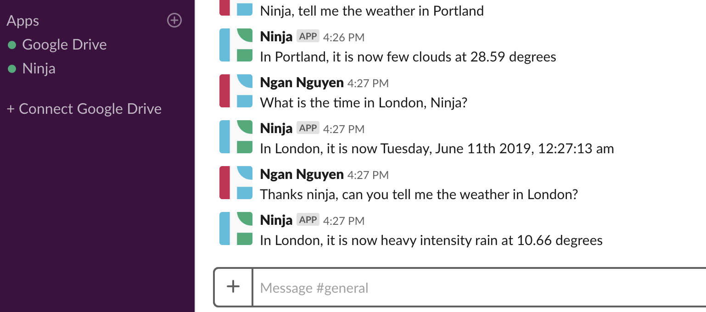

<h3 align="center"> AI SlackBot BoilerPlate</h3>
<h4 align="center"> By Ngan Nguyen </h4>

## Description

_This slackbot allows user to access the time and weather base on a location ._

# 

## Table of Content

- [Features](#Features)
- [Technology](#technology)
- [Installation](#installation)
- [License](#license)

## Features
* AI is created using Wit AI with intent set for time and weather
* Location and Time uses Google's Geocaching API and TimeZone API
* Weather API uses openweatherapi

## Technology
* Superagent
* Express
* NodeJs
* Slack
* Wit AI

## Installation

1. Go to terminal and clone this repository:
```
$ git clone git repository link
```
2. Change into the project directory and install npm
```
$ npm install
```
3. 
```
$ 
```
4.  
```
$ 
```
```
$ 
```
5.  
```
$ 
```


## License
* This project is licensed under the MIT License - see the LICENSE.md file for details